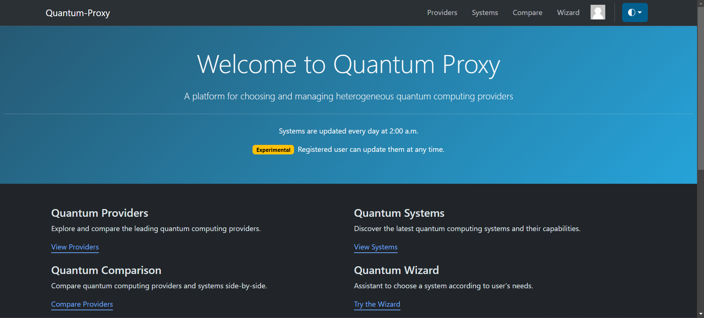
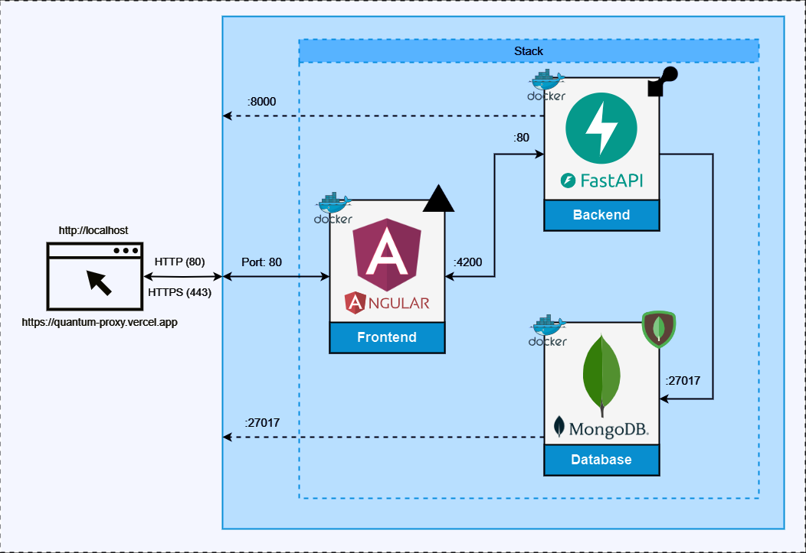

    <picture>
        <source media="(prefers-color-scheme: dark)" srcset=".github/readme/etsii-oscuro.png">
        <source media="(prefers-color-scheme: light)" srcset=".github/readme/etsii-claro.png">
        
    </picture>
     

# TFG - Quantum-Proxy

Este repositorio contiene la aplicación desarrollada como TFG, una plataforma para elegir y gestionar proveedores de computación cuántica heterogéneos.

> [!NOTE] 
> Este proyecto se encuentra desplegado en la nube, accesible a través del siguiente [enlace web](https://quantum-proxy.vercel.app). Aun así, si se desea ejecutar la aplicación de forma local, se puede hacer siguiendo las instrucciones del [manual de instalación](manual-instalacion.pdf).

> [!CAUTION]
> Debido al uso del plan gratuito de Render[^1], la aplicación puede entrar en modo de suspensión cuando no está en uso, lo que provoca un tiempo de inicio más largo al acceder por primera vez.

[^1]: Herramienta para el despliegue de aplicaciones: https://render.com/

|  |
|:--:|
| *Página Principal de la Plataforma* |

## Información del repositorio

Junto con el código fuente de la aplicación, este repositorio contiene toda la documentación referente al proyecto, incluyendo la [memoria](memoria.pdf) del TFG y el [manual de uso](manual-uso.pdf).

### Estructura del repositorio

**`backend/`**  
- Código fuente de la API REST desarrollada en FastAPI para manejar proveedores, sistemas, y cuentas de usuario.
- Toda la lógica de negocio junto con los módulos que conforman la aplicación.
- Modelos y configuración referente a la conexión con la base de datos MongoDB.

**`frontend/`**  
- Código fuente de la aplicación web desarrollada en Angular.
- Componentes y servicios que conforman la interfaz de usuario.
- Estilos y configuración de la aplicación.

**`docker-compose.yml`**  
- Archivo de configuración de Docker Compose para desplegar la aplicación en local.

## Diagrama de Infraestructura

    

> [!NOTE]
> En el mismo esquema se incluyen dos enfoques distintos de despliegue: en un entorno local con Docker Compose, y en la nube con plataformas de despliegue (Vercel, Render y MongoDB Atlas).